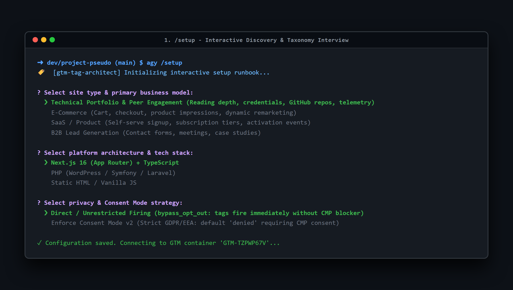
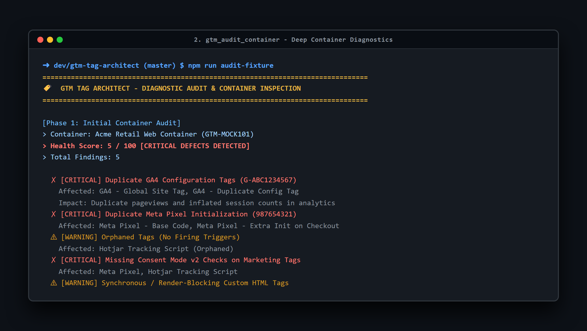
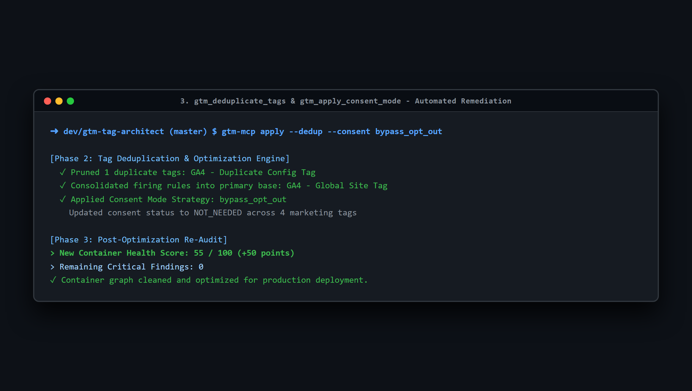
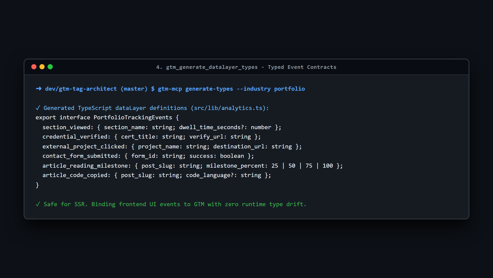

# Complete GTM MCP Setup & Credentials Guide

This guide walks you through connecting **Google Tag Manager** to AI coding agents (**Antigravity**, **Claude Code**, **Cursor**) via the **Model Context Protocol (MCP)**.

---

## 1. What is MCP and How Does It Work with GTM?

The **Model Context Protocol (MCP)** is an open standard that allows AI assistants to securely discover and execute tools on external systems.

Instead of navigating the web portal, creating tags manually, or checking firing triggers by clicking through menus, MCP allows the agent to:
- Inspect active GTM containers, tags, triggers, and variables directly.
- Identify duplicate tags, orphaned firing rules, and unconsented tracking.
- Apply automated fixes (deduplication, Consent Mode v2 gating) and generate typed frontend `dataLayer` contracts.

---

## 2. Choosing Your Connection Mode

`gtm-tag-architect` supports two connection modes:

| Feature | Mode A: Offline Export (Zero-API / No GCP Needed) | Mode B: Live Google Tag Manager API |
| :--- | :--- | :--- |
| **Setup Time** | < 1 minute | 5 minutes |
| **API Keys Needed?** | **No** | Yes (Google Cloud Service Account) |
| **Live Read/Write** | Reads exported JSON file | Real-time workspace reads & updates |
| **Best For** | Local testing, audits, container refactoring | Production CI/CD & live container management |

---

## 3. Mode A: Offline JSON Export (Fastest Setup)

If you don't have Google Cloud Console access or want to test immediately without API keys:

1. Log in to [Google Tag Manager](https://tagmanager.google.com/).
2. Select your Account and Container.
3. Navigate to **Admin** > **Export Container**.
4. Select the latest version or workspace, and click **Export**.
5. Save the `.json` file to your project directory (e.g. `./container.json`).
6. Set the environment variable in `mcp_config.json` or `.env`:
   ```json
   {
     "mcpServers": {
       "gtm-tag-architect": {
         "command": "node",
         "args": ["/path/to/gtm-tag-architect/bin/gtm-mcp.js"],
         "env": {
           "GTM_OFFLINE_CONTAINER_PATH": "./container.json"
         }
       }
     }
   }
   ```

---

## 4. Mode B: Live Google Tag Manager REST API Setup

To enable real-time container inspection and automated tag deployment, set up a Google Cloud Service Account.

### Step 1: Create a Google Cloud Project & Enable GTM API
1. Go to the [Google Cloud Console](https://console.cloud.google.com/).
2. Create a new project (e.g., `gtm-agent-integration`) or select an existing one.
3. In the top search bar, search for **"Tag Manager API"** and click **Enable**.

### Step 2: Create a Service Account & Download Key
1. In Google Cloud Console, navigate to **IAM & Admin** > **Service Accounts**.
2. Click **Create Service Account**:
   - **Name:** `gtm-mcp-agent`
   - **Role:** *Project > Viewer* (or leave blank).
3. Click **Done**.
4. Click on the newly created service account email.
5. Go to the **Keys** tab > **Add Key** > **Create new key** > Choose **JSON**.
6. A `.json` credentials file will download to your computer. Save it securely (e.g., `~/.credentials/gtm-service-account.json`).

### Step 3: Grant Service Account Access in Google Tag Manager
1. Open [Google Tag Manager](https://tagmanager.google.com/).
2. Go to **Admin** > **User Management** (either Account or Container level).
3. Click the blue **+** button in the top right > **Add Users**.
4. Paste your Service Account email (e.g., `gtm-mcp-agent@your-project.iam.gserviceaccount.com`).
5. Select Container Permissions:
   - **Read:** If you only want the agent to audit and propose diffs.
   - **Edit / Publish:** If you want the agent to automatically create tags or update workspaces.
6. Click **Save**.

---

## 5. How to Obtain Required Platform Tracking IDs

When running the `/setup` interview command, the agent will ask for your platform IDs. Here is where to find each:

### 1. Google Analytics 4 (GA4) Measurement ID
- **Format:** `G-XXXXXXXXXX`
- **Where to find:**
  1. Open [Google Analytics](https://analytics.google.com/).
  2. Go to **Admin** (bottom left gear icon) > **Data collection and modification** > **Data Streams**.
  3. Click your Web stream.
  4. Copy the **Measurement ID** (top right).

### 2. Meta Pixel ID (Facebook / Instagram)
- **Format:** Numeric ID (e.g., `987654321012345`)
- **Where to find:**
  1. Open [Meta Events Manager](https://business.facebook.com/events_manager2).
  2. Select your Business Account and click **Data Sources**.
  3. Select your Pixel or Dataset.
  4. Under **Settings**, copy the **Dataset ID / Pixel ID**.

### 3. LinkedIn Insight Tag (Partner ID)
- **Format:** Numeric ID (e.g., `1234567`)
- **Where to find:**
  1. Open [LinkedIn Campaign Manager](https://www.linkedin.com/campaignmanager/).
  2. Go to **Analyze** > **Insight Tag**.
  3. Select **I will use a tag manager** and copy your **Partner ID**.

### 4. Google Ads Conversion ID & Label
- **Format:** Conversion ID `AW-XXXXXXXXXX` | Label `AbCdEfGhIjKlMnOpQr`
- **Where to find:**
  1. Open [Google Ads](https://ads.google.com/).
  2. Go to **Goals** > **Conversions** > **Summary**.
  3. Click your Conversion Action > **Tag Setup** > **Use Google Tag Manager**.
  4. Copy the **Conversion ID** and **Conversion Label**.

### 5. PostHog Project API Key
- **Format:** `phc_xxxxxxxxxxxxxxxxxxxxxxxx`
- **Where to find:**
  1. Log in to [PostHog](https://us.posthog.com/ or your self-hosted instance).
  2. Go to **Project Settings**.
  3. Copy your **Project API Key** and note your **API Host** (`https://us.i.posthog.com` or `https://eu.i.posthog.com`).

---

## 6. Configuring MCP Clients

### A. Google Antigravity
The plugin is automatically discovered if placed in `.agents/plugins/gtm-tag-architect` or `~/.gemini/config/plugins/gtm-tag-architect`.

To specify custom environment variables, edit `.agents/plugins/gtm-tag-architect/mcp_config.json`:
```json
{
  "mcpServers": {
    "gtm-tag-architect": {
      "command": "node",
      "args": ["./bin/gtm-mcp.js"],
      "env": {
        "GTM_OFFLINE_CONTAINER_PATH": "./fixtures/sample-ecommerce-container.json",
        "GOOGLE_APPLICATION_CREDENTIALS": "C:/path/to/service-account.json"
      }
    }
  }
}
```

### B. Claude Code / Claude Desktop
Add to your `claude_desktop_config.json`:
```json
{
  "mcpServers": {
    "gtm-tag-architect": {
      "command": "node",
      "args": ["C:/Users/New PC/Documents/dev/gtm-tag-architect/bin/gtm-mcp.js"],
      "env": {
        "GTM_OFFLINE_CONTAINER_PATH": "C:/path/to/container.json"
      }
    }
  }
}
```

### C. Cursor IDE
1. Open Cursor Settings > **Features** > **MCP Servers**.
2. Click **+ Add New MCP Server**.
3. Name: `gtm-tag-architect`
4. Type: `command`
5. Command: `node C:/Users/New PC/Documents/dev/gtm-tag-architect/bin/gtm-mcp.js`

---

## 7. Step-by-Step Execution Walkthrough (Offline & Online)

When you run `/setup`, the plugin executes a deterministic 4-stage pipeline:

---

### Step 1: Interactive Discovery & Taxonomy Interview
The agent initiates an interactive interview to understand your platform architecture, business model, tracking requirements, and privacy strategy.



**Example Interaction:**
- **Site Type:** Technical Portfolio & Peer Engagement
- **Framework:** Next.js App Router (Client & Server Components)
- **Tracking Scope:** Section dwell times, reading milestones, credential verification clicks, contact form telemetry
- **Privacy Strategy:** Direct / Unrestricted Firing (`bypass_opt_out`)

---

### Step 2: Container Ingestion & Deep Diagnostic Audit
The audit engine parses the container graph, detects defect patterns, and computes an objective Container Health Score (0-100).



**Diagnostic Output:**
```text
[Container Diagnostic Report]
> Health Score: 5/100
> Critical Defects:
  - [CRITICAL] Duplicate GA4 Configuration Tags (G-ABC1234567)
  - [CRITICAL] Duplicate Meta Pixel Initialization (987654321)
  - [CRITICAL] Missing Consent Mode v2 Checks on Marketing Tags
> Warnings:
  - [WARNING] Orphaned Tags (No Firing Triggers)
  - [WARNING] Synchronous / Render-Blocking Custom HTML Tags
```

---

### Step 3: Automated Tag Deduplication & Consent Remediation
The engine automatically deduplicates redundant base scripts, consolidates firing triggers into primary tags, and applies the selected privacy mode.



**Optimization Output:**
```text
[Phase 2: Tag Deduplication & Privacy Enforcement]
✓ Pruned duplicate GA4 configuration tags
✓ Consolidated into primary base tag on 'Initialization - All Pages'
✓ Applied Consent Mode strategy ('bypass_opt_out') to all marketing pixels
> New Health Score: 55/100 (+50 points)
```

---

### Step 4: Typed Contract Generation & Frontend Codebase Integration
The plugin generates typed TypeScript definitions (`dataLayer.d.ts`) or native PHP classes (`GtmDataLayer.php`), ensuring complete type safety between code events and GTM triggers.



**Generated Frontend Code Contract:**
```typescript
// dataLayer.d.ts - Generated by gtm-tag-architect for Technical Portfolio
export interface PortfolioTrackingEvents {
  section_viewed: { section_name: string; dwell_time_seconds?: number };
  credential_verified: { cert_title: string; verify_url: string };
  external_project_clicked: { project_name: string; destination_url: string };
  contact_form_submitted: { form_id: string; success: boolean };
  article_reading_milestone: { post_slug: string; milestone_percent: 25 | 50 | 75 | 100 };
}
```

